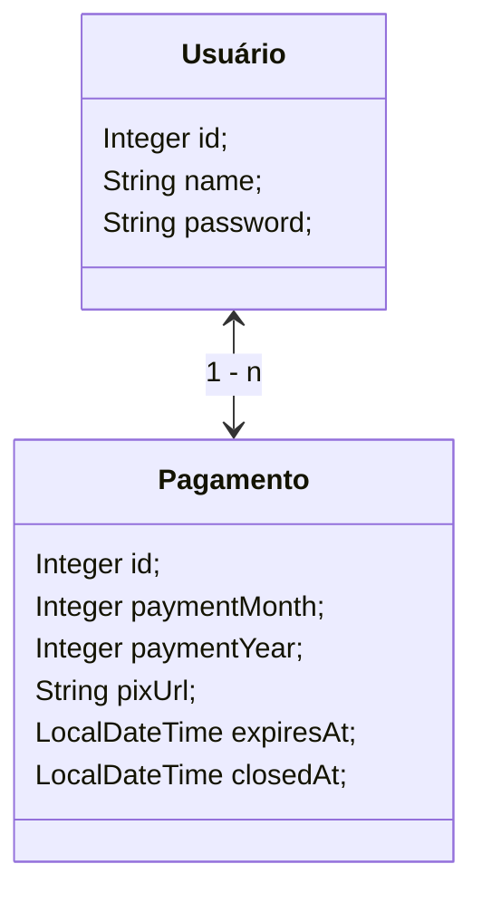

# Pagamento de Mensalidades
Aplicação web que ajuda a realizar **pagamentos via pix** ou **verificar transferências anteriores**. Projeto foi iniciado com intuito de auxiliar com os registros e transferencias de um centro religioso local.

# Arquitetura
Detalhes da Implementação:
 - A implementação é feita com **Spring Boot** e **JDK 17**.
 - As tranferências Pix são gerenciadas através da Api do **Banco EFI**.
 - Os dados são persistidos por gerencia do **JPA**, e em nosso caso, numa conexão a um banco **PostgreSQL**.
 - O **FrontEnd** é gerado *server side* com uso do **Thymeleaf** apenas com **js** e **css**.
 - ## Entidades Relacionais

# Acesso e Execução

 - Um deploy da aplicação pode ser **acessado** através do [*link*](https://pagamento-carnes-production.up.railway.app/).
	> por estar em um plano gratuito da **railway**, é normal receber *502 Bad Gateway* em um primeiro acesso. Basta recarregar a página por uma segunda vez.

 - Para executar localmente é recomendado a utilização do **Docker**. Com as descrições do ***DockerFile*** atual, o projeto será executado no modo de ***desenvolvimento***. Mockando as conexões da **api pix** e do **banco de dados**
	 > Para uma execução com dados mockados
	 >	- **SPRING_PROFILES_ACTIVE**: `dev`
	 
	 > Para uma execução em produção
	 > - **SPRING_PROFILES_ACTIVE**: *`prd`*
	 >	- **EFI_CLIENT_ID**:  	*credenciais de projeto*
	 > - **EFI_CLIENT_SECRET**: *credenciais de projeto*
	 > - **EFI_URL**:  *`https://pix.api.efipay.com.br (default)`*
	 > - **PGHOST**:  *endereço do seu banco Postgree*
	 > - **PGPORT**:  *porta ouvida pelo banco de dados*
	 > - **PGDATABASE**:  *nome do banco de dados utilizado*

# Testes e Validações
Para realizar testes localmente execute o comando abaixo na pasta raiz da aplicação.
	
	gradle test

<!--# Atualização e Monitoramento-->
